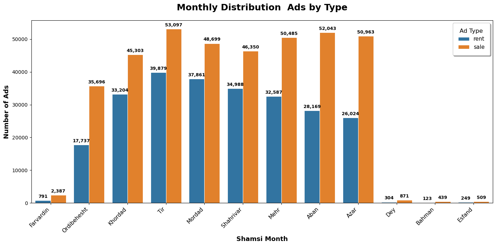
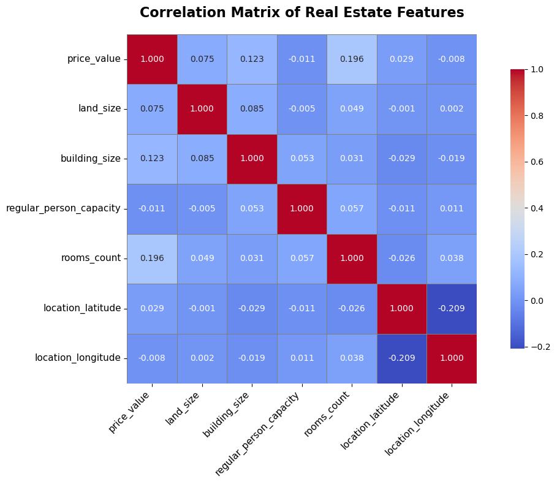

## Executive Summary

This report presents a comprehensive statistical analysis of the Divar real estate dataset, containing over one million property advertisements from Iran's leading real estate platform. The analysis covers market distribution patterns, pricing trends, geographical insights, and luxury property characteristics across different regions and time periods.

## Dataset Overview

The Divar dataset encompasses diverse property listings including residential and commercial properties with detailed features such as:
- Geographic information (city, neighborhood, coordinates)
- Physical characteristics (area, rooms, construction year)
- Financial details (rent, sale price, deposit)
- Amenities and features (elevator, parking, balcony, etc.)
- Temporal data (posting dates in Persian calendar)

## Methodology and Data Preprocessing

### Geographic Filtering
- Applied Iran boundary filtering using GeoPandas and Natural Earth data
- Removed 5,930 outlier points located outside Iran's borders
- Final dataset: 649,678 verified Iran-based properties

### Outlier Detection
Implemented multi-method outlier detection approach:
- **IQR Method**: 2.5 × IQR bounds for robust outlier identification
- **Z-Score**: Applied for normally distributed data (threshold: 3.5)
- **Isolation Forest**: Used for large datasets (contamination: 5%)

### Data Standardization
- Persian to English number conversion
- Room count mapping (Persian text to numerical values)
- Boolean feature standardization
- Price normalization using transformable price concepts

## Key Findings

### 1. Market Distribution Analysis

**Category Level 2 Distribution:**
- **Residential Sales**: 55.7% (361,589 ads) - Dominant market segment
- **Residential Rent**: 28.1% (182,575 ads) - Second largest category
- **Commercial Rent**: 7.8% (50,559 ads)
- **Commercial Sales**: 3.9% (25,253 ads)
- **Other categories**: <3% each (temporary rent, real estate services)

**Category Level 3 Analysis:**
- **Apartment Sales**: 203,724 ads (highest volume)
- **Apartment Rent**: 144,011 ads
- **Plot Sales**: 83,689 ads
- **House/Villa Sales**: 74,176 ads
- Clear dominance of apartment-based transactions in the market

### 2. Construction Year Patterns

**Construction Timeline Insights:**
- **Peak Period**: 1398-1403 (2019-2024) showing recent construction boom
- **Mean Construction Year**: 1393.6 (≈2015)
- **Median**: 1395.0 (≈2016)  
- **Mode**: 1403.0 (≈2024) - Most common construction year
- **Historical Range**: 1370-1403 (33-year span)

The distribution shows a significant increase in construction activity post-2010, with a notable spike in recent years, indicating active development and urban expansion.

### 3. Seasonal Market Activity

**Seasonal Trends:**
- **Peak Months**: Ordibehesht (April-May) and Tir (June-July) show highest activity
- **Sale Ads Peak**: Ordibehesht with 53,097 advertisements
- **Rental Market**: More stable throughout the year with peak in Tir (39,879 ads)
- **Seasonal Pattern**: Spring and early summer months show increased market activity
- **Winter Slowdown**: Dey, Bahman, and Esfand show significantly reduced activity

This pattern aligns with traditional Persian New Year (Nowruz) moving patterns and favorable weather conditions for property transactions.

### 4. Geographic Distribution and Market Density

**Geographic Insights:**
- Successfully filtered 649,678 properties within Iran's borders
- Removed 5,930 outlier coordinates outside national boundaries
- High concentration in major metropolitan areas
- Tehran province shows highest density clusters
- Secondary clusters visible in major cities like Isfahan, Mashhad, and Shiraz

The heatmap analysis reveals clear urban concentration patterns, with metropolitan areas dominating the real estate advertisement landscape.

<iframe src="./results-pic/IranGeo-Ads_HeatMap.html" width="100%" height="500px" frameborder="0"></iframe>

### 5. Price Distribution Analysis

**Sales Price Distribution by Category:**
- Apartment sales show wide price variation with median-focused distribution
- Villa and house sales demonstrate higher price ranges
- Commercial properties show distinct pricing patterns
- Significant outlier management required due to data entry variations

### 6. Temporal Price Trends

**Rental Price Seasonality:**
- Average rental prices show seasonal fluctuation
- Higher rental rates during peak moving months (spring/summer)
- Correlation between seasonal demand and pricing

**Inflation-Adjusted Analysis (1400-1403):**
- Nominal prices show consistent upward trend
- Real prices (inflation-adjusted to 1400 base year) reveal different market dynamics
- Analysis incorporates Iran's inflation rates: 40.2% (1400), 45.3% (1401), 50.4% (1402), 55.5% (1403)

### 7. Feature Correlation Analysis

**Correlation Matrix Findings:**
- Strong positive correlation between building size and price value
- Moderate correlation between room count and property value
- Geographic coordinates show regional pricing patterns
- Land size impacts vary by property type

### 8. Luxury Property Analysis

**Luxury Features Analyzed:**
- Balcony, Elevator, Security Guard, Barbecue, Pool amenities
- Weighted scoring system based on price impact
- Top luxury neighborhoods identified through comprehensive scoring

**Key Luxury Markets:**
- Tehran's upscale neighborhoods dominate luxury property concentrations
- Clear correlation between luxury amenities and property values
- Geographic clustering of high-end properties in specific areas

## Technical Implementation

### Data Processing Pipeline
1. **Data Import**: Pandas-based CSV processing
2. **Cleaning**: Multi-step validation and standardization
3. **Geographic Validation**: GeoPandas spatial analysis
4. **Outlier Management**: Statistical and ML-based detection
5. **Visualization**: Matplotlib, Seaborn, and Folium integration

### Quality Assurance
- Comprehensive null value handling
- Data type validation and conversion
- Geographic boundary verification
- Statistical outlier detection and treatment

### Persian Calendar Integration
- PersianTools library for accurate date conversion
- Shamsi (Persian) to Gregorian calendar mapping
- Monthly and yearly aggregation in Persian calendar context

## Market Insights and Implications

### 1. Market Maturity
The dataset reveals a mature real estate market with:
- Diverse property types and price ranges
- Seasonal trading patterns consistent with cultural practices
- Geographic concentration reflecting urbanization trends

### 2. Digital Platform Adoption
High advertisement volume indicates:
- Strong digital platform adoption in Iran's real estate sector
- Comprehensive market coverage across property types
- Active engagement from both individuals and real estate professionals

### 3. Economic Indicators
Price trend analysis provides insights into:
- Inflation impact on property values
- Regional economic disparities
- Market activity correlations with seasonal factors

## Recommendations

### For Market Analysis
1. **Seasonal Strategy**: Align marketing and sales efforts with identified peak months
2. **Geographic Focus**: Prioritize high-density urban areas for maximum market impact
3. **Price Modeling**: Incorporate seasonal and regional factors in pricing strategies

### For Platform Development
1. **Feature Enhancement**: Leverage luxury amenity data for improved search and recommendation systems
2. **Geographic Services**: Utilize coordinate data for location-based services
3. **Trend Analysis**: Implement real-time market trend monitoring based on identified patterns

### For Further Research
1. **Micro-Market Analysis**: Detailed neighborhood-level price analysis
2. **Predictive Modeling**: Machine learning models for price prediction
3. **Economic Correlation**: Integration with broader economic indicators

## Conclusion

This analysis of the Divar real estate dataset reveals a dynamic and diverse property market with clear seasonal patterns, geographic concentrations, and evolving construction trends. The comprehensive data preprocessing and multi-dimensional analysis provide valuable insights for market participants, researchers, and platform developers.

The combination of traditional market behaviors (seasonal patterns, luxury clustering) with modern digital platform adoption demonstrates Iran's real estate market's complexity and sophistication. The dataset serves as a robust foundation for continued market research, predictive modeling, and strategic decision-making in the Iranian real estate sector.

---

*Analysis conducted using Python data science stack including Pandas, NumPy, Matplotlib, Seaborn, GeoPandas, and specialized Persian date handling libraries. All visualizations and statistical analyses follow established data science methodologies with appropriate outlier detection and data validation procedures.*