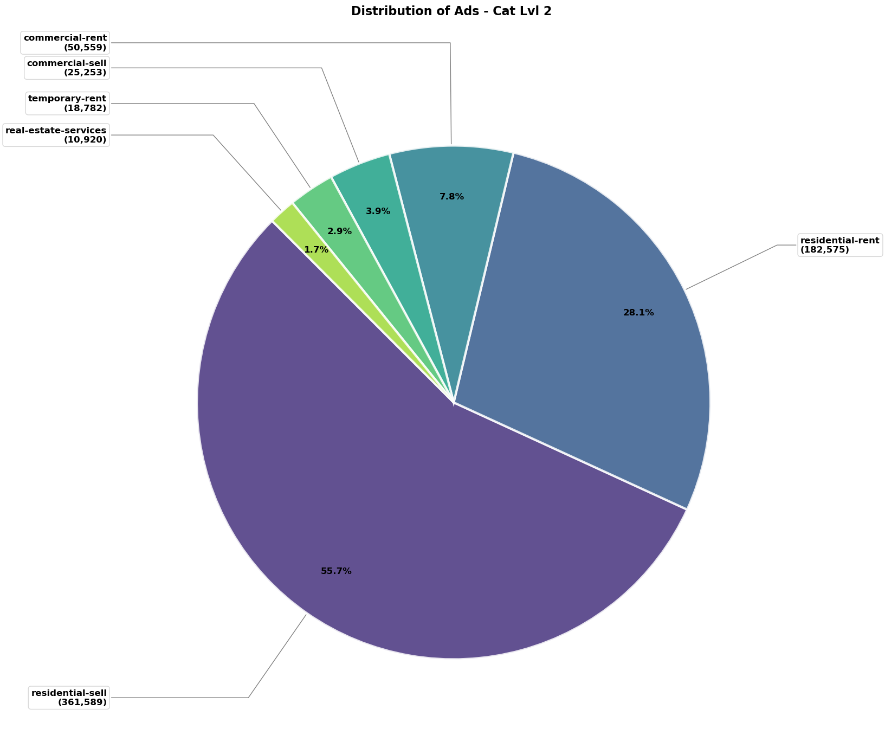
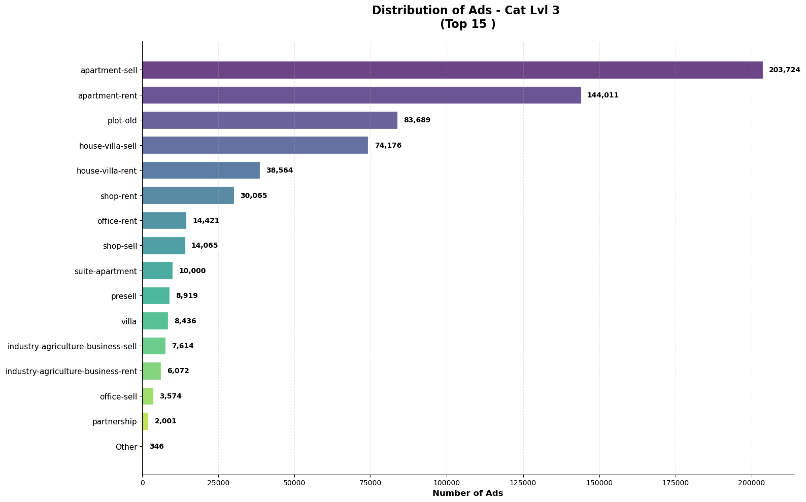
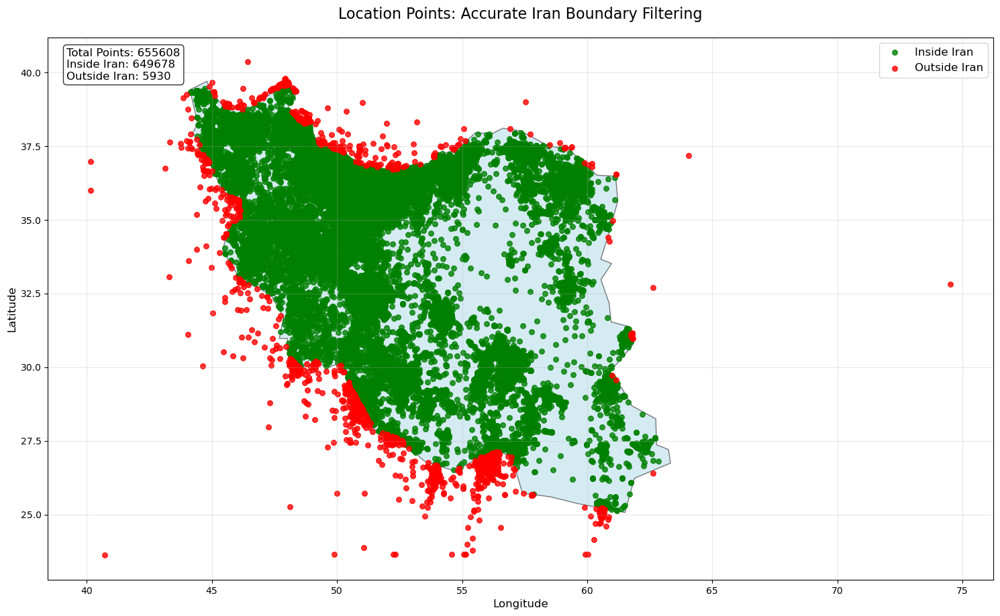
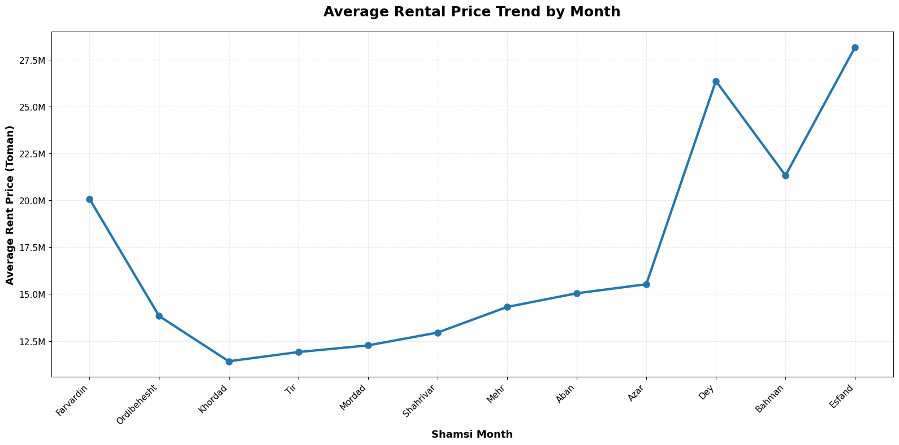
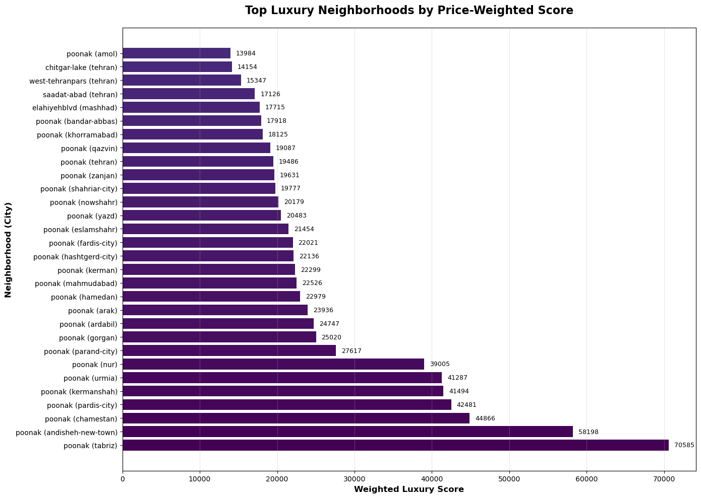

# گزارش تحلیل جامع بازار املاک ایران بر پایه داده‌های دیوار

## چکیده اجرایی

این گزارش، تحلیل آماری جامعی از مجموعه داده‌های پلتفرم املاک «دیوار» ارائه می‌دهد که شامل بیش از **یک میلیون آگهی** ملک در پلتفرم پیشروی املاک ایران است. تحلیل‌های انجام‌شفته الگوهای توزیع بازار، روندهای قیمتی، بینش‌های جغرافیایی و ویژگی‌های املاک لاکچری در مناطق و بازه‌های زمانی مختلف را پوشش می‌دهد.

## مرور کلی مجموعه داده

مجموعه داده دیوار شامل لیست‌های متنوعی از املاک مسکونی و تجاری به همراه ویژگی‌های دقیق آن‌ها است، از جمله:
-   **اطلاعات جغرافیایی** (شهر، محله، مختصات)
-   **ویژگی‌های کالبدی** (متراژ، تعداد اتاق، سال ساخت)
-   **جزئیات مالی** (قیمت اجاره، فروش، رهن)
-   **امکانات** (آسانسور، پارکینگ، بالکن و غیره)
-   **داده‌های زمانی** (تاریخ انتشار آگهی بر اساس تقویم شمسی)

## روش‌شناسی و پیش‌پردازش داده

### فیلتر جغرافیایی
-   اعمال فیلتر مرزهای ایران با استفاده از GeoPandas و داده‌های Natural Earth
-   حذف ۵۹۳۰ نقطه پرت واقع در خارج از مرزهای ایران
-   مجموعه داده نهایی: ۶۴۹,۶۷۸ ملک تأیید‌شده واقع در ایران

### شناسایی داده‌های پرت (Outlier Detection)
اجرای یک رویکرد چند‌مرحله‌ای برای شناسایی داده‌های پرت:
-   **روش IQR**: شناسایی قوی داده‌های پرت با استفاده از بازه ۲.۵ برابر IQR
-   **Z-Score**: اعمال شده بر روی داده‌های با توزیع نرمال (آستانه: ۳.۵)
-   **Isolation Forest**: استفاده شده برای مجموعه داده‌های حجیم (نسبت آلودگی: ۵٪)

### استاندارد‌سازی داده‌ها
-   تبدیل اعداد از فارسی به انگلیسی
-   نگاشت مقادیر متنی تعداد اتاق به مقادیر عددی
-   استاندارد‌سازی ویژگی‌های بولین (True/False)
-   نرمال‌سازی قیمت‌ها با استفاده از مفاهیم تبدیل‌پذیر (مانند تومان و میلیون تومان)

## یافته‌های کلیدی

### ۱. تحلیل توزیع بازار

**توزیع دسته‌بندی سطح ۲:**
-   **فروش مسکونی**: ۵۵.۷٪ (۳۶۱,۵۸۹ آگهی) - بخش غالب بازار
-   **اجاره مسکونی**: ۲۸.۱٪ (۱۸۲,۵۷۵ آگهی) - دومین دسته بزرگ
-   **اجاره تجاری**: ۷.۸٪ (۵۰,۵۵۹ آگهی)
-   **فروش تجاری**: ۳.۹٪ (۲۵,۲۵۳ آگهی)
-   **سایر دسته‌ها**: کمتر از ۳٪ برای هرکدام (اجاره موقت، خدمات املاک و...)

**تحلیل دسته‌بندی سطح ۳:**
-   **آپارتمان فروشی**: ۲۰۳,۷۲۴ آگهی (بیشترین حجم)
-   **آپارتمان اجاره‌ای**: ۱۴۴,۰۱۱ آگهی
-   **زمین فروشی**: ۸۳,۶۸۹ آگهی
-   **خانه/ویلا فروشی**: ۷۴,۱۷۶ آگهی
-   وضوح سلطه معاملات مبتنی بر آپارتمان در بازار

### ۲. الگوهای سال ساخت املاک

**بینش‌های خط زمانی ساخت:**
-   **دوره اوج**: ۱۴۰۳-۱۳۹۸ - نشان‌دهنده رونق ساخت‌وساز اخیر
-   **میانگین سال ساخت**: ۱۳۹۳.۶ (≈۲۰۱۵ میلادی)
-   **میانه**: ۱۳۹۵.۰ (≈۲۰۱۶ میلادی)
-   **نما**: ۱۴۰۳.۰ (≈۲۰۲۴ میلادی) - رایج‌ترین سال ساخت
-   **بازه تاریخی**: ۳۳ سال (۱۴۰۳-۱۳۷۰)

توزیع، افزایش قابل توجهی در فعالیت ساخت‌وساز پس از سال ۱۳۸۹ (۲۰۱۰) را نشان می‌دهد که حاکی از توسعه فعال و گسترش شهری است.

### ۳. فعالیت فصلی بازار

**روندهای فصلی:**
-   **ماه‌های اوج**: اردیبهشت و تیر بیشترین فعالیت را نشان می‌دهند.
-   **اوج آگهی‌های فروش**: اردیبهشت با ۵۳,۰۹۷ آگهی
-   **بازار اجاره**: در طول سال پایدارتر است و اوج آن در تیر (۳۹,۸۷۹ آگهی) قرار دارد.
-   **الگوی فصلی**: ماه‌های بهار و اوایل تابستان افزایش فعالیت بازار را نشان می‌دهند.
-   **رکود زمستانی**: دی، بهمن و اسفند کاهش قابل توجهی در فعالیت را نشان می‌دهند.

این الگو با الگوهای جابجایی پس از سال نو (نوروز) و شرایط آب‌وهوایی مساعد برای معاملات ملک همخوانی دارد.

### ۴. توزیع جغرافیایی و تراکم بازار

**بینش‌های جغرافیایی:**
-   فیلتر موفقیت‌آمیز ۶۴۹,۶۷۸ ملک در داخل مرزهای ایران
-   حذف ۵,۹۳۰ مختصات پرت خارج از مرزهای ملی
-   تمرکز بالا در مناطق کلان‌شهری اصلی
-   استان تهران بالاترین خوشه‌های تراکم را نشان می‌دهد.
-   خوشه‌های ثانویه در شهرهای بزرگی مانند اصفهان، مشهد و شیراز قابل مشاهده است.

تحلیل نقشه حرارتی، الگوهای واضح تمرکز شهری را نشان می‌دهد که در آن مناطق کلان‌شهری بر چشم‌انداز آگهی‌های املاک تسلط دارند.

<iframe src="./results-pic/IranGeo-Ads_HeatMap.html" width="100%" height="500px" frameborder="0"></iframe>

### ۵. تحلیل توزیع قیمت

**توزیع قیمت فروش بر اساس دسته:**
-   فروش آپارتمان تغییرات قیمتی گسترده‌ای با توزیع متمرکز بر میانه نشان می‌دهد.
-   فروش ویلا و خانه محدوده قیمتی بالاتری را نشان می‌دهند.
-   املاک تجاری الگوهای قیمت‌گذاری متمایزی نشان می‌دهند.
-   مدیریت قابل توجه داده‌های پرت به دلیل تغییرات در ورود داده مورد نیاز است.

### ۶. روندهای زمانی قیمت

** فصلی بودن قیمت‌های اجاره:**
-   قیمت‌های متوسط اجاره نوسانات فصلی را نشان می‌دهند.
-   نرخ‌های اجاره بالاتر در ماه‌های اوج جابجایی (بهار/تابستان)
-   همبستگی بین تقاضای فصلی و قیمت‌گذاری

**تحلیل تعدیل‌شده با تورم (۱۴۰۳-۱۴۰۰):**
-   قیمت‌های اسمی روند صعودی ثابتی را نشان می‌دهند.
-   قیمت‌های واقعی (تعدیل‌شده با تورم با سال پایه ۱۴۰۰) dynamics متفاوتی از بازار را نشان می‌دهند.
-   تحلیل نرخ‌های تورم ایران را شامل می‌شود: ۴۰.۲٪ (۱۴۰۰), ۴۵.۳٪ (۱۴۰۱), ۵۰.۴٪ (۱۴۰۲), ۵۵.۵٪ (۱۴۰۳)

### ۷. تحلیل همبستگی ویژگی‌ها

**یافته‌های ماتریس همبستگی:**
-   همبستگی مثبت قوی بین اندازه ساختمان و ارزش قیمت
-   همبستگی متوسط بین تعداد اتاق و ارزش ملک
-   مختصات جغرافیایی الگوهای قیمت‌گذاری منطقه‌ای را نشان می‌دهند.
-   تاثیر اندازه زمین بر اساس نوع ملک متفاوت است.

### ۸. تحلیل املاک لاکچری

**ویژگی‌های لوکس تحلیل‌شده:**
-   امکاناتی مانند بالکن، آسانسور, نگهبان, باربیکیو, استخر
-   سیستم امتیازدهی وزنی بر اساس تاثیر بر قیمت
-   شناسایی محله‌های برتر لاکچری از طریق امتیازدهی جامع

**بازارهای کلیدی لوکس:**
-   محله‌های اعیان‌نشین تهران بر تمرکز املاک لوکس تسلط دارند.
-   همبستگی واضح بین امکانات لوکس و ارزش املاک
-   خوشه‌بندی جغرافیایی املاک high-end در مناطق خاص

## پیاده‌سازی فنی

### خط لوله پردازش داده
۱.  **ورود داده**: پردازش CSV مبتنی بر Pandas
۲.  **پاک‌سازی**: اعتبارسنجی و استاندارد‌سازی چند‌مرحله‌ای
۳.  **اعتبارسنجی جغرافیایی**: تحلیل فضایی با GeoPandas
۴.  **مدیریت داده‌های پرت**: شناسایی آماری و مبتنی بر یادگیری ماشین
۵.  **نمایش داده**: یکپارچه‌سازی Matplotlib, Seaborn و Folium

### تضمین کیفیت
-   مدیریت جامع مقادیر Null
-   اعتبارسنجی و تبدیل نوع داده
-   تأیید مرزهای جغرافیایی
-   شناسایی و مدیریت داده‌های پرت آماری

### یکپارچه‌سازی تقویم شمسی
-   کتابخانه PersianTools برای تبدیل دقیق تاریخ
-   نگاشت تقویم شمسی به میلادی
-   تجمیع ماهانه و سالانه در چارچوب تقویم شمسی

## بینش‌های بازار و پیامدها

### ۱. بلوغ بازار
مجموعه داده یک بازار املاک بالغ را نشان می‌دهد با:
-   انواع ملک و محدوده‌های قیمتی متنوع
-   الگوهای معاملاتی فصلی سازگار با رویه‌های فرهنگی
-   تمرکز جغرافیایی منعکس‌کننده روندهای شهرنشینی

### ۲. پذیرش پلتفرم دیجیتال
حجم بالای آگهی نشان‌دهنده:
-   پذیرش قوی پلتفرم دیجیتال در بخش املاک ایران
-   پوشش جامع بازار در انواع املاک
-   مشارکت فعال هر دو گروه افراد حقیقی و مشاوران املاک

### ۳. شاخص‌های اقتصادی
تحلیل روند قیمت بینشی در مورد موارد زیر ارائه می‌دهد:
-   تاثیر تورم بر ارزش املاک
-   شکاف‌های اقتصادی منطقه‌ای
-   همبستگی فعالیت بازار با عوامل فصلی

## توصیه‌ها

### برای تحلیل بازار
۱.  **استراتژی فصلی**: همسو کردن تلاش‌های بازاریابی و فروش با ماه‌های اوج شناسایی‌شده
۲.  **تمرکز جغرافیایی**: اولویت‌دهی به مناطق شهری با تراکم بالا برای حداکثر تاثیر بازار
۳.  **مدل‌سازی قیمت**: گنجاندن عوامل فصلی و منطقه‌ای در استراتژی‌های قیمت‌گذاری

### برای توسعه پلتفرم
